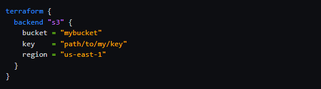
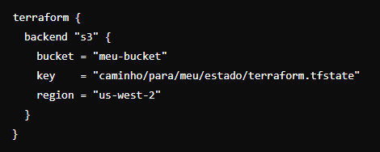
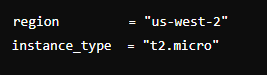

# Resource: aws_key_pair
https://registry.terraform.io/providers/hashicorp/aws/latest/docs/resources/key_pair

# file Function
https://developer.hashicorp.com/terraform/language/functions/file

# Backend
https://developer.hashicorp.com/terraform/language/settings/backends/s3#data-source-configuration

 * Example Configuration

# Create kay-pair
 $ ssh-keygen -f aws-key

# Resource: aws_instance
https://registry.terraform.io/providers/hashicorp/aws/latest/docs/resources/instance#argument-reference

# AWS VM com VPC utilizando remote state no Terraform
Este projeto fornece um exemplo de como criar uma máquina virtual (VM) na AWS dentro de uma VPC utilizando o Terraform, com o estado armazenado remotamente.

# Visão Geral
Este repositório contém a configuração do Terraform necessária para provisionar uma infraestrutura básica na AWS. A infraestrutura inclui:

* Uma VPC com sub-redes públicas e privadas.
* Uma instância EC2 em uma das sub-redes públicas.
* Utilização do estado remoto para armazenar o estado do Terraform.

# Estrutura do Repositório
* main.tf: Define os recursos principais do projeto.
* variables.tf: Define as variáveis de entrada para o projeto.
* outputs.tf: Define as saídas que serão exibidas após a execução do Terraform.
* backend.tf: Configura o estado remoto.

# Pré-requisitos
Antes de começar, você precisará das seguintes ferramentas instaladas:

* Terraform
* AWS CLI

Além disso, você deve configurar suas credenciais AWS, que podem ser feitas utilizando o comando aws configure.

# Configuração
Backend Remoto
Certifique-se de configurar o backend remoto corretamente no arquivo backend.tf:

# Variáveis
Preencha as variáveis necessárias no arquivo variables.tf ou utilize um arquivo terraform.tfvars para defini-las. 

Exemplo:

# Uso
Clone o repositório: